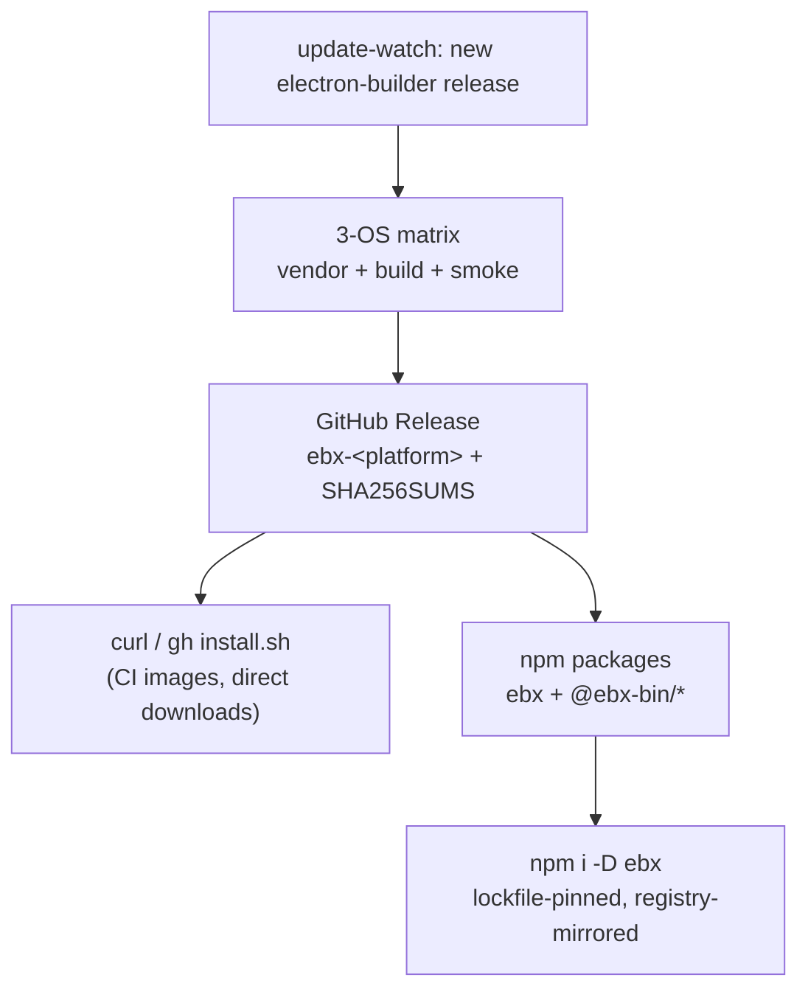

# Distributing ebx

Two channels, one source of truth (GitHub Releases built by CI):

## GitHub Releases (live today)

Every release ships `ebx-darwin-arm64`, `ebx-linux-x64`, `ebx-win32-x64.exe`,
and `SHA256SUMS`. `install.sh` downloads, sha-verifies, and installs to
`~/.local/bin`. Tags follow `v<electron-builder>-ebx.<n>`.

## npm (scaffolded, publish pending a registry decision)

The esbuild pattern — binaries **held in** the registry, never downloaded by a
postinstall script:

- **`ebx`** (root): a ~40-line bin shim plus `optionalDependencies` on every
  platform package. npm/pnpm/yarn install only the one matching `os`/`cpu`.
- **`@ebx-bin/<platform>-<arch>`**: one binary each, `os`/`cpu`-gated.

Why no postinstall downloader: it breaks offline/hermetic installs, fails
behind firewalls, adds a supply-chain hop lockfiles can't pin, and trips
`--ignore-scripts` policies. With optionalDependencies the binary bytes are
content-addressed by the registry and mirror through private registries
(Artifactory/Verdaccio) with zero configuration.

`scripts/npm-pack.mjs <artifacts-dir> <version>` assembles all packages from
release artifacts into `build/npm/`, ready for `npm publish` (platform
packages first, root last). Wiring it into the release workflow is one job —
gated on choosing a registry:

- **npmjs (public)** — the community route; requires the repo/name going public.
- **GitHub Packages (private)** — works today with `GITHUB_TOKEN`, but consumers
  need an `.npmrc` scope pointing at GH Packages; names become `@imlucas/…`.

## Version scheme

`26.15.3-ebx.0`: upstream electron-builder version, then an ebx iteration
counter for launcher-side changes on the same upstream. Valid semver, sorts
correctly, and a glance tells you exactly which upstream you're running.
