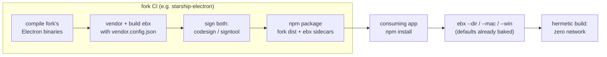

# Building ebx for an Electron fork

A fork of Electron (custom patches, own release cadence, own binary hosting)
can ship its **own branded ebx** so every consuming app builds hermetically
against the fork's binaries — no npm tree, no tool downloads, no version
guessing. Proven end-to-end 2026-08-14 with a simulated fork: a branded ebx
with baked defaults packaged an app from a bare `ebx --dir` under a
network-denied sandbox.



## The config

Drop a `vendor.config.json` in your ebx checkout (or point `EBX_VENDOR_CONFIG`
at one) before `node scripts/build.mjs`:

```json
{
  "label": "starship",
  "electron-builder": "26.15.3",
  "defaultArgs": [
    "-c.electronVersion=37.2.4",
    "-c.electronDist=node_modules/@starship/electron-dist/dist"
  ]
}
```

- **label** shows up in `ebx --ebx-version` so a build log says which flavor ran.
- **electron-builder** overrides the pinned version if the fork certifies a
  specific one.
- **defaultArgs** are baked into the binary and prepended on every build
  invocation — anything the user passes explicitly overrides them (last flag
  wins). Point `electronDist` at wherever the fork's npm package puts its
  binaries, relative to the consuming project.

## Sidecar layout

The fork's published npm package carries the ebx binaries next to the dist:

```
@starship/electron/
├── dist/                 # the fork's compiled Electron, per platform
├── ebx/
│   ├── ebx-darwin-arm64  # branded, signed
│   ├── ebx-linux-x64
│   └── ebx-win32-x64.exe
└── package.json          # "bin": { "starship-package": "ebx/run.js" }  (thin shim)
```

Sign the sidecars in the same CI that signs the fork's binaries — they are
Mach-O/PE executables like any other (macOS: `codesign` + notarize with the
rest of the package's payload; Windows: `signtool`). ebx's launcher never
self-modifies, so signatures stay valid; the vendored payload extracts to a
cache directory, not into the binary.

## The hermetic recipe

1. `electronDist` baked to the sidecar dist → no Electron download, no
   checksum phone-home (the stock download path revalidates checksums against
   GitHub even when the zip is cached — a local dist skips all of it).
2. The embedded tool cache covers NSIS/AppImage/7zip → no toolset downloads.
3. `ebx fetch --wincodesign` once per cache if you sign Windows binaries.
4. Native modules: use prebuilds (napi-rs) so nothing compiles at package time.

Verify on macOS the same way this repo did:

```bash
sandbox-exec -p '(version 1)(allow default)(deny network*)' ebx --dir
```

## Building in the fork's CI

Reuse this repo's build workflow (`.github/workflows/build.yml` is
`workflow_call`-able) or replicate its three steps: `node scripts/build.mjs`
with `EBX_VENDOR_CONFIG` set, `bash scripts/smoke.sh`, upload. Vendor on the
platform you target — toolsets and optional deps are host-specific.
